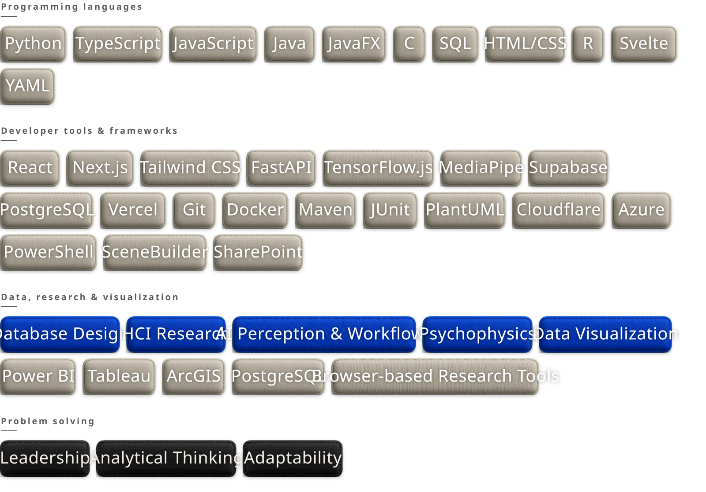

<picture>
  <source media="(prefers-color-scheme: dark)" srcset="assets/hero-dark.svg">
  
</picture>

  
  
  
  

  <b>Full Stack Developer</b> &nbsp;·&nbsp; <b>Data Analyzer</b> &nbsp;·&nbsp; <b>Research Honours Student</b> &nbsp;·&nbsp; Calgary, AB

 

<picture>
  <source media="(prefers-color-scheme: dark)" srcset="assets/h-hello-dark.svg">
  
</picture>

I'm an **Honours Computer Science** student at the **University of Calgary** (Software Engineering concentration, Data Science minor, Certificate in Entrepreneurial Thinking), working across full-stack software, human-centred data research, embedded systems and RF communications.

I care about making complex systems understandable, dependable and useful to the people they serve: bridging front end and back end, research and working software, ambitious ideas and reliable execution. Outside the editor, I lead student communities, give campus tours and help run faculty communications.

 

<picture>
  <source media="(prefers-color-scheme: dark)" srcset="assets/h-now-dark.svg">
  
</picture>

| Role                                | Where                                                           | Working with                                                          |
| ----------------------------------- | --------------------------------------------------------------- | --------------------------------------------------------------------- |
| **Data Research Intern**            | Alberta Innovates · UCalgary iLab & HealthVis Futures · Bruyère | Patient-profiling dashboard and visual data stories for dementia care |
| **Software & Programmable Systems** | Biomedical Engineering Research and Innovation Team             | C++, React and BLE for an accessible four-button remote               |
| **RF Communications, SAT-2**        | CalgaryToSpace                                                  | Python, GNU Radio and ground-station telemetry for a 3U CubeSat       |
| **Senior Software Developer**       | UCalgary Baja                                                   | Svelte, Docker, Cloudflare and vehicle telemetry for 55+ members      |
| **Full-stack Developer**            | Enactus UCalgary · Project WealthPath                           | Full-stack software for a student-led social enterprise               |

 

<picture>
  <source media="(prefers-color-scheme: dark)" srcset="assets/h-work-dark.svg">
  
</picture>

| Project                                                                                            | What it is                                                                                          | Stack                             | Signal                         |
| -------------------------------------------------------------------------------------------------- | --------------------------------------------------------------------------------------------------- | --------------------------------- | ------------------------------ |
| [**Health Data Dashboard**](https://muhammad-ahmad.dev/work/alberta-innovates-health-dashboard)    | Human-centred visual data stories that help clinicians understand patient needs before appointments | HCI, data visualization           | Alberta Innovates research     |
| [**FrontierSat RF Comms**](https://muhammad-ahmad.dev/work/frontiersat-rf-communications)          | Ground-station and onboard communications for a student-built 3U CubeSat                            | Python, C/C++, GNU Radio          | In progress                    |
| [**SilentSpeaker**](https://muhammad-ahmad.dev/work/silent-speaker)                                | Real-time, in-browser translation between ASL signs and text or speech                              | TensorFlow.js, MediaPipe, FastAPI | ~94% accuracy, 7,000+ gestures |
| [**Calgary Transit Accessibility**](https://muhammad-ahmad.dev/work/calgary-transit-accessibility) | Mapping transit access and commute efficiency across Calgary                                        | Tableau, ArcGIS, open data        | 200+ communities analyzed      |
| [**Freight Cargo System**](https://muhammad-ahmad.dev/work/freight-cargo-system)                   | Full-stack inventory, shipment and admin platform on normalized PostgreSQL                          | Next.js, Supabase, PostgreSQL     | 15 tables, 6 continents        |
| [**Student Gaming Platform**](https://muhammad-ahmad.dev/work/student-gaming-platform)             | Desktop platform for networked Tic-Tac-Toe and Connect Four                                         | Java, JavaFX, TCP                 | 245 JUnit tests                |
| [**Baja Digital Systems**](https://muhammad-ahmad.dev/work/ucalgary-baja-systems)                  | Web, onboarding, infrastructure and telemetry for a student vehicle team                            | Svelte, Docker, telemetry         | 55+ members supported          |

<a href="https://muhammad-ahmad.dev/work"><b>All 15 projects on the portfolio ↗</b></a>

<picture>
  <source media="(prefers-color-scheme: dark)" srcset="assets/h-toolkit-dark.svg">
  
</picture>

 

<picture>
  <source media="(prefers-color-scheme: dark)" srcset="assets/skills-dark.svg">
  
</picture>

 

<picture>
  <source media="(prefers-color-scheme: dark)" srcset="assets/h-path-dark.svg">
  
</picture>

- **BSc (Honours) Computer Science**, University of Calgary · 2024 to 2028
- **CVR-VISTA Vision Science Summer School**, York University · 2026 · vision science, computer vision and AI perception
- **Leadership:** Junior Team Lead of the Faculty of Science Communications Ambassadors (8,000+ student audience), Vice-President Internal of the Pakistani Students Society, Science Stampede booth team lead, UCalgary campus tour guide

Full timeline on the [Career Trajectory](https://muhammad-ahmad.dev/career) page.

 

<picture>
  <source media="(prefers-color-scheme: dark)" srcset="assets/footer-dark.svg">
  
</picture>
