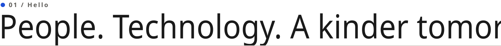
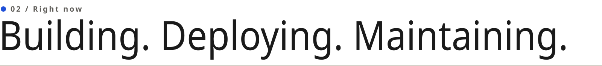
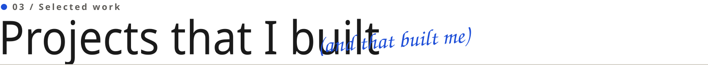
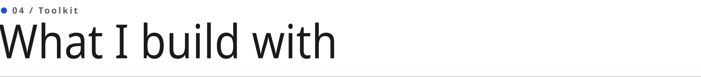
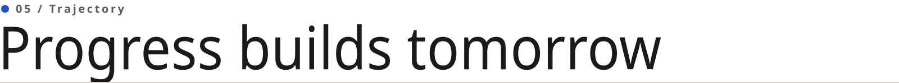
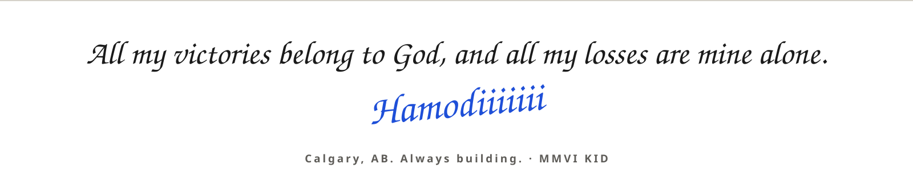

  <b>Full Stack Software Developer</b> &nbsp;·&nbsp; <b>Data Analyzer</b> &nbsp;·&nbsp; <b>Research Honours Student</b> &nbsp;·&nbsp; <b>AI Driven</b> &nbsp;·&nbsp; Calgary, AB

 

<picture>
  <source media="(prefers-color-scheme: dark)" srcset="assets/h-hello-dark.svg">
  
</picture>

I'm a 3rd year **Honours Computer Science** student at the **University of Calgary** (Software Engineering concentration, Data Science minor, Embedded Certificate in Entrepreneurial Thinking), working across full-stack software development, human and software research, data analysis and visualizations, and lastly, with AI tools for coding, development and comparisons.

I care about making complex systems understandable, dependable and useful to the people they serve: bridging front-end and back-end, research and working software, ambitious ideas and reliable execution. Outside the editor, I help run student communities, help with university recruitment and operations, and love travelling the world.

 

<picture>
  <source media="(prefers-color-scheme: dark)" srcset="assets/h-now-dark.svg">
  
</picture>

| Role                                       | Where                                              | Since    | Working on                                                                                                                                                                                                       |
| ------------------------------------------ | -------------------------------------------------- | -------- | ---------------------------------------------------------------------------------------------------------------------------------------------------------------------------------------------------------------- |
| **Undergraduate Honours Research Project** | CPSC 502.06 - University of Calgary                | Aug 2026 | LLM-based regression test selection using commit diffs to reduce CI/CD testing, evaluated on reproducible Java and Python projects from BugSwarm                                                                 |
| **Full-Stack Developer**                   | Enactus - University of Calgary                    | Jan 2026 | A financial-literacy platform with videos, quizzes, progress tracking and AI-evaluated responses, used to teach 120+ rural Alberta students. TypeScript, React, Next.js, Python, Flask and 22 REST API endpoints |
| **RF Communications Software Developer**   | CalgaryToSpace - Rothney Astrophysical Observatory | Aug 2025 | Python ground-station software, the ICOM IC-9700 with GNU Radio and GPredict, and C/C++ telemetry on FrontierSat's STM32-based OBC                                                                               |
| **Senior Software Developer**              | UCalgary Baja                                      | Aug 2024 | The full-stack team website (Svelte, Cloudflare), Docker infrastructure at 97% uptime for 60+ members, and a live web-telemetry race dashboard                                                                   |

 

<picture>
  <source media="(prefers-color-scheme: dark)" srcset="assets/h-work-dark.svg">
  
</picture>

| Project                                                                                                                                      | What it is                                                                                                          | Stack                                             | Signal                                         |
| -------------------------------------------------------------------------------------------------------------------------------------------- | ------------------------------------------------------------------------------------------------------------------- | ------------------------------------------------- | ---------------------------------------------- |
| [**VISR (Flowgram)**](https://github.com/MA-Hamodi/visr-hackathon)                                                                           | Daily execution platform turning long-term student goals into day and week schedules, built at the Cursor Hackathon | Next.js, Supabase/PostgreSQL, Groq Llama API, Zod | Project Flowgram lead                          |
| [**SilentSpeaker**](https://github.com/MA-Hamodi/silent-speaker-hackathon)                                                                   | Real-time ASL accessibility platform translating sign to text/speech and back, built at HackTheBias Hackathon       | TensorFlow.js, MediaPipe, FastAPI                 | ~40% to ~94% accuracy, 7,000+ labeled gestures |
| [**Freight Cargo Inventory & Shipment System**](https://github.com/MA-Hamodi/freight-cargo-inventory-and-shipment-management-system-cpsc471) | Full-stack freight management platform on a normalized PostgreSQL database (CPSC 471)                               | Next.js, TypeScript, Tailwind CSS, Supabase       | 15 tables, 63 locations, 77 containers         |
| [**Student Gaming Platform**](https://github.com/MA-Hamodi/student-gaming-platform-sgp-seng300)                                              | Desktop Tic-Tac-Toe and Connect Four with local TCP multiplayer, lobbies, chat and leaderboards (SENG 300)          | Java, JavaFX, Maven, JUnit                        | Led a 17-member team                           |
| [**Cricket Score Tracker**](https://github.com/MA-Hamodi/cricket-score-tracker-cpsc233)                                                      | Dual-mode JavaFX and CLI app for teams, player statistics and a Dream Team algorithm (CPSC 233)                     | Java, JavaFX, JUnit 5                             | CSV persistence                                |
| [**Flightonics**](https://github.com/MA-Hamodi/flightonics)                                                                                  | Live global flight tracker rendered as an animated radar-style map from OpenSky data                                | Python, Flask, Leaflet                            | Live aircraft animation                        |

<a href="https://muhammad-ahmad.dev/work"><b>All 15 projects on the portfolio ↗</b></a>

<picture>
  <source media="(prefers-color-scheme: dark)" srcset="assets/h-toolkit-dark.svg">
  
</picture>

 

<picture>
  <source media="(prefers-color-scheme: dark)" srcset="assets/skills-dark.svg">
  
</picture>

 

<picture>
  <source media="(prefers-color-scheme: dark)" srcset="assets/h-path-dark.svg">
  
</picture>

- **BSc (Honours) Computer Science**, University of Calgary · 2024 to 2028
- **CVR-VISTA Vision Science Summer School**, York University · 2026 · vision science, computer vision and AI perception

Full timeline on the [Career Trajectory](https://muhammad-ahmad.dev/career) page.

 

<picture>
  <source media="(prefers-color-scheme: dark)" srcset="assets/footer-dark.svg">
  
</picture>
